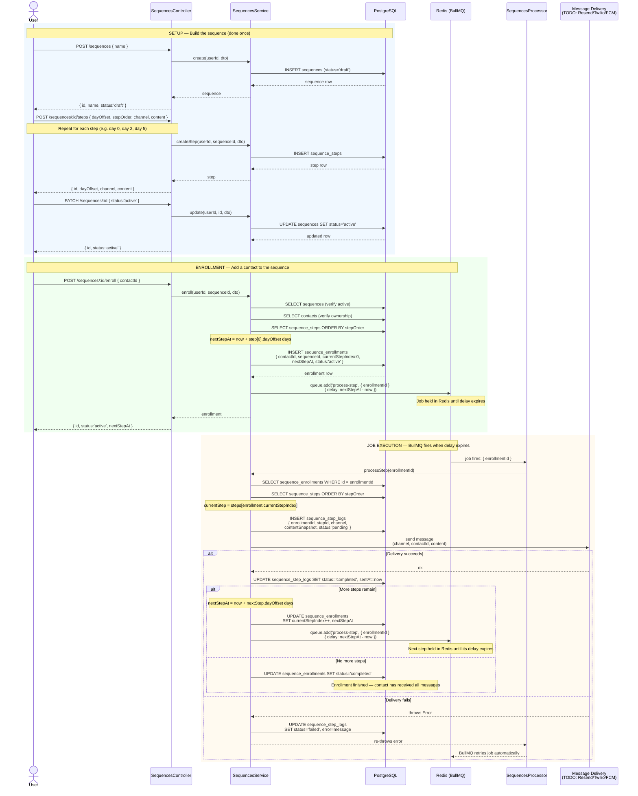
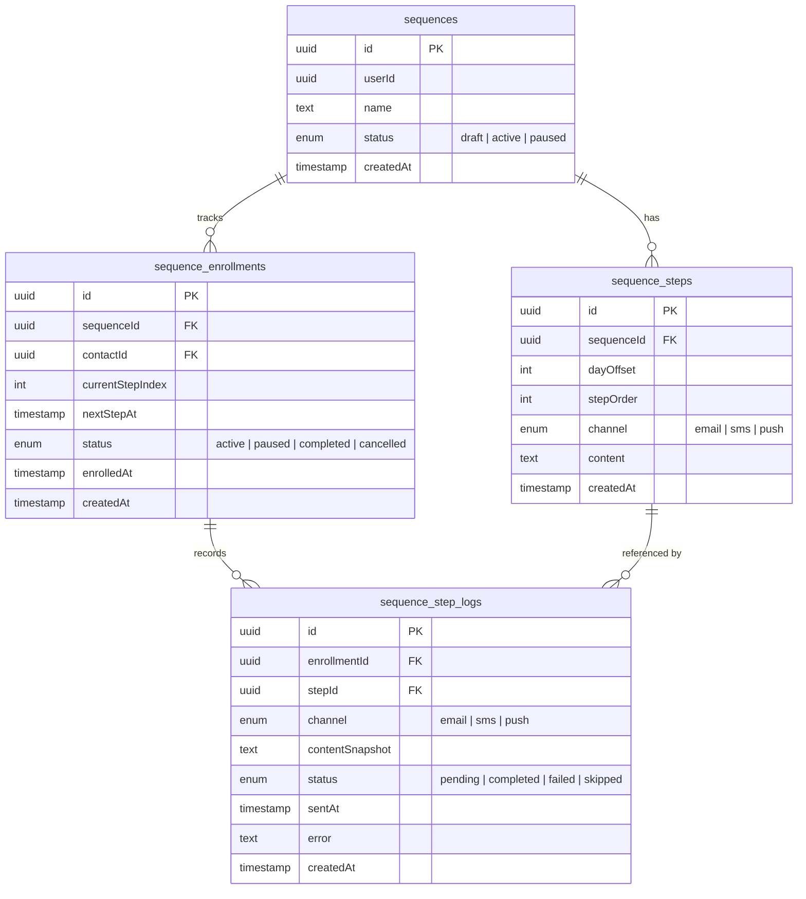
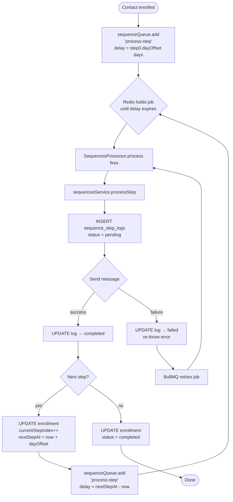

# Sequences — Flow Diagram

## Full Lifecycle

```mermaid
sequenceDiagram
    actor User
    participant Controller as SequencesController
    participant Service as SequencesService
    participant DB as PostgreSQL
    participant Redis as Redis (BullMQ)
    participant Processor as SequencesProcessor
    participant Delivery as Message Delivery<br/>(TODO: Resend/Twilio/FCM)

    %% ── SETUP PHASE ──────────────────────────────────────────────────────────
    rect rgb(240, 248, 255)
        Note over User,DB: SETUP — Build the sequence (done once)

        User->>Controller: POST /sequences { name }
        Controller->>Service: create(userId, dto)
        Service->>DB: INSERT sequences (status='draft')
        DB-->>Service: sequence row
        Service-->>Controller: sequence
        Controller-->>User: { id, name, status:'draft' }

        User->>Controller: POST /sequences/:id/steps { dayOffset, stepOrder, channel, content }
        Note over User,Controller: Repeat for each step (e.g. day 0, day 2, day 5)
        Controller->>Service: createStep(userId, sequenceId, dto)
        Service->>DB: INSERT sequence_steps
        DB-->>Service: step row
        Service-->>Controller: step
        Controller-->>User: { id, dayOffset, channel, content }

        User->>Controller: PATCH /sequences/:id { status:'active' }
        Controller->>Service: update(userId, id, dto)
        Service->>DB: UPDATE sequences SET status='active'
        DB-->>Service: updated row
        Controller-->>User: { id, status:'active' }
    end

    %% ── ENROLLMENT PHASE ─────────────────────────────────────────────────────
    rect rgb(240, 255, 240)
        Note over User,Redis: ENROLLMENT — Add a contact to the sequence

        User->>Controller: POST /sequences/:id/enroll { contactId }
        Controller->>Service: enroll(userId, sequenceId, dto)
        Service->>DB: SELECT sequences (verify active)
        Service->>DB: SELECT contacts (verify ownership)
        Service->>DB: SELECT sequence_steps ORDER BY stepOrder
        Note over Service: nextStepAt = now + step[0].dayOffset days
        Service->>DB: INSERT sequence_enrollments<br/>{ contactId, sequenceId, currentStepIndex:0,<br/>  nextStepAt, status:'active' }
        DB-->>Service: enrollment row
        Service->>Redis: queue.add('process-step', { enrollmentId },<br/>{ delay: nextStepAt - now })
        Note over Redis: Job held in Redis until delay expires
        Service-->>Controller: enrollment
        Controller-->>User: { id, status:'active', nextStepAt }
    end

    %% ── JOB EXECUTION PHASE ──────────────────────────────────────────────────
    rect rgb(255, 250, 240)
        Note over Redis,DB: JOB EXECUTION — BullMQ fires when delay expires

        Redis->>Processor: job fires: { enrollmentId }
        Processor->>Service: processStep(enrollmentId)
        Service->>DB: SELECT sequence_enrollments WHERE id = enrollmentId
        Service->>DB: SELECT sequence_steps ORDER BY stepOrder

        Note over Service: currentStep = steps[enrollment.currentStepIndex]

        Service->>DB: INSERT sequence_step_logs<br/>{ enrollmentId, stepId, channel,<br/>  contentSnapshot, status:'pending' }

        Service->>Delivery: send message<br/>(channel, contactId, content)

        alt Delivery succeeds
            Delivery-->>Service: ok
            Service->>DB: UPDATE sequence_step_logs SET status='completed', sentAt=now

            alt More steps remain
                Note over Service: nextStepAt = now + nextStep.dayOffset days
                Service->>DB: UPDATE sequence_enrollments<br/>SET currentStepIndex++, nextStepAt
                Service->>Redis: queue.add('process-step', { enrollmentId },<br/>{ delay: nextStepAt - now })
                Note over Redis: Next step held in Redis until its delay expires
            else No more steps
                Service->>DB: UPDATE sequence_enrollments SET status='completed'
                Note over DB: Enrollment finished — contact has received all messages
            end

        else Delivery fails
            Delivery-->>Service: throws Error
            Service->>DB: UPDATE sequence_step_logs<br/>SET status='failed', error=message
            Service-->>Processor: re-throws error
            Processor-->>Redis: BullMQ retries job automatically
        end
    end
```

---

## Database Relationships

```mermaid
erDiagram
    sequences {
        uuid id PK
        uuid userId
        text name
        enum status "draft | active | paused"
        timestamp createdAt
    }

    sequence_steps {
        uuid id PK
        uuid sequenceId FK
        int dayOffset
        int stepOrder
        enum channel "email | sms | push"
        text content
        timestamp createdAt
    }

    sequence_enrollments {
        uuid id PK
        uuid sequenceId FK
        uuid contactId FK
        int currentStepIndex
        timestamp nextStepAt
        enum status "active | paused | completed | cancelled"
        timestamp enrolledAt
        timestamp createdAt
    }

    sequence_step_logs {
        uuid id PK
        uuid enrollmentId FK
        uuid stepId FK
        enum channel "email | sms | push"
        text contentSnapshot
        enum status "pending | completed | failed | skipped"
        timestamp sentAt
        text error
        timestamp createdAt
    }

    sequences ||--o{ sequence_steps : "has"
    sequences ||--o{ sequence_enrollments : "tracks"
    sequence_enrollments ||--o{ sequence_step_logs : "records"
    sequence_steps ||--o{ sequence_step_logs : "referenced by"
```

---

## BullMQ Job Chain

```mermaid
flowchart TD
    A([Contact enrolled]) --> B[sequenceQueue.add\n'process-step'\ndelay = step0.dayOffset days]
    B --> C{Redis holds job\nuntil delay expires}
    C --> D[SequencesProcessor.process fires]
    D --> E[sequencesService.processStep]
    E --> F[INSERT sequence_step_logs\nstatus = pending]
    F --> G{Send message}
    G -->|success| H[UPDATE log → completed]
    G -->|failure| I[UPDATE log → failed\nre-throw error]
    I --> J[BullMQ retries job]
    J --> D
    H --> K{Next step?}
    K -->|yes| L[UPDATE enrollment\ncurrentStepIndex++\nnextStepAt = now + dayOffset]
    L --> M[sequenceQueue.add\n'process-step'\ndelay = nextStepAt - now]
    M --> C
    K -->|no| N[UPDATE enrollment\nstatus = completed]
    N --> O([Done])
```
