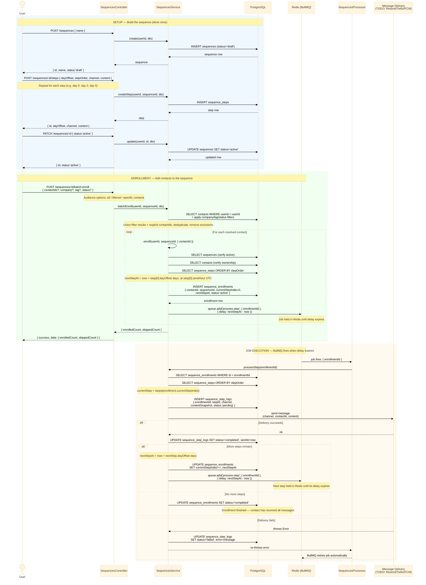
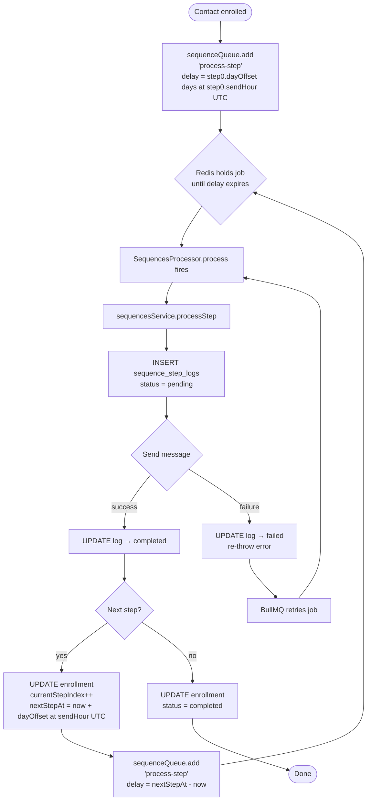
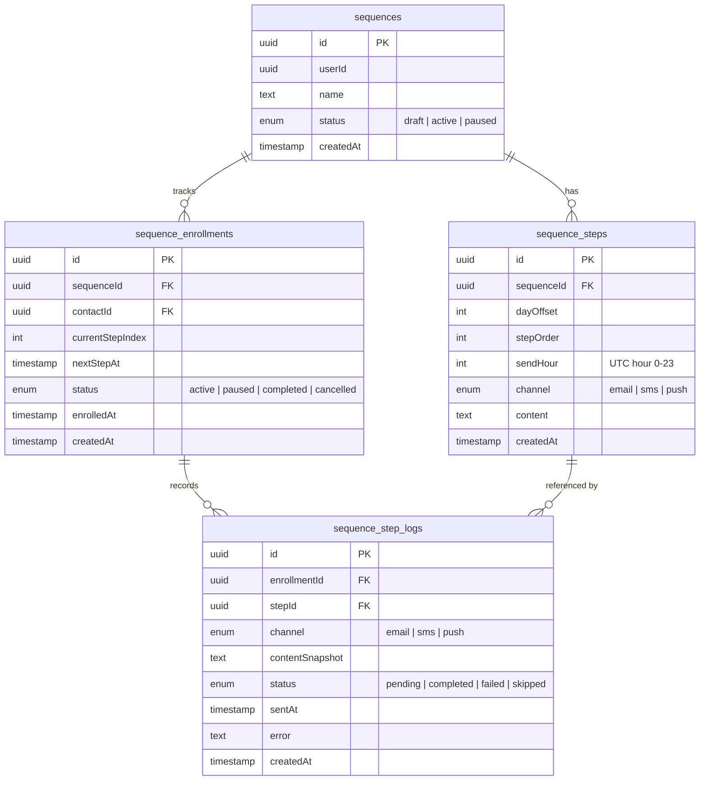

# Sequences — Flow Diagram

---

## What is a Sequence? (Plain English)

A **sequence** is a series of scheduled messages sent to a contact over time.

Think of it like a drip campaign:
- Day 0 → "Welcome!" email
- Day 3 → "How's it going?" SMS
- Day 7 → "Here's a tip" push notification

You build the steps first, publish the sequence to lock it in, then enroll contacts.
Once enrolled, the system automatically sends each message at the right time — no manual work needed.

---

## The 3 Phases (Plain English)

### Phase 1 — Build (Setup)
You create the sequence and add steps to it.
Nothing is sent yet. The sequence sits in **draft** status.

### Phase 2 — Publish
You click "Publish & Activate". The sequence flips to **active**.
Only active sequences can accept contacts. This is intentional — you shouldn't enroll people into an incomplete sequence.

### Phase 3 — Enroll & Send
You pick which contacts to enroll (all, filtered by company/tag/status, or specific people).
The system schedules a background job for each contact. When the timer runs out, the message goes out, and the next step is scheduled automatically. This repeats until all steps are done.

---

## Full Lifecycle (Technical Diagram)



---

## Job Cycle — Plain English

Here's what happens behind the scenes after a contact is enrolled:

1. **A timer is set.** The moment a contact is enrolled, the system figures out when the first message should go out (e.g. "9 AM on day 0") and hands a job to Redis — like dropping a note in a to-do box with a timestamp.

2. **Redis holds the job.** Nothing happens until the clock runs out. The job just waits in Redis. The app can restart, the server can reboot — the job survives.

3. **The timer expires, the job fires.** BullMQ (the job runner) picks up the job and calls `processStep`. This is the worker doing its job.

4. **A log entry is created first.** Before sending anything, a record is created in `sequence_step_logs` with `status: pending`. This acts as a paper trail — if something crashes mid-send, we know which step was in progress.

5. **The message is sent.** The worker calls the delivery service (email/SMS/push). If it succeeds, the log is updated to `completed`.

6. **Next step is scheduled.** If there are more steps, the same "set a timer" process repeats for the next one. If it was the last step, the enrollment is marked `completed`.

7. **If the send fails**, the log is marked `failed` and the job is re-thrown. BullMQ automatically retries it (with backoff). The contact doesn't miss a step because of a temporary glitch.

---

## Enrollment Status Lifecycle — Plain English

Each enrolled contact goes through these states:

| Status | What it means |
|---|---|
| `active` | Contact is in the sequence, steps are being sent |
| `paused` | Temporarily stopped (e.g. you paused it manually) — no new jobs fire |
| `completed` | All steps have been sent — done |
| `cancelled` | Removed from the sequence before finishing |

```
enrolled → active → completed
                 ↘ paused → active (if resumed)
                 ↘ cancelled
```

---

## BullMQ Job Chain (Technical Diagram)



---

## Database Relationships


